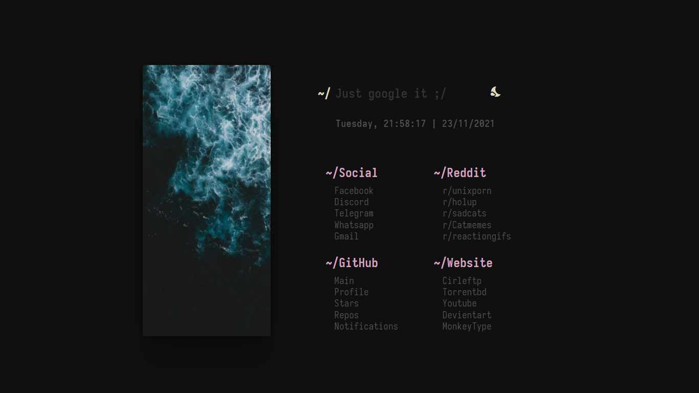

# startpage

Yet another minimal startpage:
- Font: iosevka web
- Theme: Nightfall
- Screen resulation: 1366x768 (change `style.css` to match yours)

> **NOTE**: keep it in mind that I don't own any rights to image included in this repo.  
> **Original repo**: [HeavyRain266/startpage](https://github.com/HeavyRain266/startpage)  
> **Font**: [pvinis/iosevka-webfont](https://github.com/pvinis/iosevka-webfont)  

## Configuration
- Simply edit `style.css` and setup favourite font and colors!
- Add more image on `assets` folder and check `line 60` on `index.js`
- Change search engine on `line 48` in `index.js`

## Installation
### Chrome:
- Clone the repo into your directory.
- Open `chrome://extensions/` and click `load unpacked`
- Select the folder you've just cloned and you're done.

## Preview:

